<h1 align="center">👋 Hola, soy Matías Bordonaro</h1>

<h3 align="center">Desarrollador de Software</h3>

  Desarrollador de software con experiencia en proyectos académicos y personales.

  <a href="https://www.linkedin.com/in/matias-bordonaro-a3683737a/">LinkedIn</a>
  •
  <a href="mailto:bordonaromatias1@gmail.com">Email</a>

---

## 👨🏻‍💻 Sobre mí

Tengo formación en **Desarrollo de Aplicaciones Informáticas** y experiencia en el desarrollo de aplicaciones web, tanto en **front-end como en back-end**.

He trabajado con APIs, bases de datos, autenticación y arquitecturas de microservicios, participando tanto en proyectos individuales como grupales.

Me interesa seguir creciendo como desarrollador y participar en proyectos y equipos de desarrollo profesionales.

---

## 🛠️ Tecnologías

### 💻 Lenguajes

  
  
  
  

### 🎨 Front-end

  
  
  
  
  

### ⚙️ Back-end

  
  
  
  
  
  

### 🗄️ Bases de datos

  
  
  

### 🧪 Testing

  
  
  

### 🖥️ Infraestructura

  
  
  

### 🧰 Herramientas

  
  
  
  
  
  
  

---

## 🚀 Proyectos destacados

### 🥗 Farmacy Food

Plataforma que permite a **emprendedores ofrecer sus comidas saludables** y a los usuarios realizar pedidos online.

Proyecto realizado por un equipo de 5 integrantes, realizado mediante una arquitectura de microservicios.

**Mi participación:**

* Desarrollo de los microservicios de usuarios y notificaciones.
* Participación en autenticación y autorización.
* Desarrollo de APIs y persistencia de datos.
* Coordinación e integración del trabajo del equipo en las distintas user stories.
* Containerización y despliegue de los servicios mediante Docker y Docker Compose..

**Tecnologías:** Java · Spring Boot · Spring Security · JWT · Microservicios · JPA / Hibernate · MySQL · PostgreSQL · MongoDB · Docker · REST APIs

---

### 🍔 Cluckin' Bell Menú

Aplicación web desarrollada con **Angular** que simula un menú y sistema de pedidos online para un restaurante.

* Visualización y filtrado de productos.
* Carrito de compras.
* Consumo de API.
* Diseño responsive.
* Aplicación SPA.

**Tecnologías:** Angular · TypeScript · JavaScript · HTML · CSS · Bootstrap

---

## 📚 Formación

**Tecnicatura Universitaria en Desarrollo de Aplicaciones Informáticas**

Universidad Nacional del Centro de la Provincia de Buenos Aires (UNICEN)

**2023 – 2026 · Cursada finalizada**

---

## 📊 GitHub Stats

  
  

---

## 📫 Contacto

  
  

